{:.center-imgs}
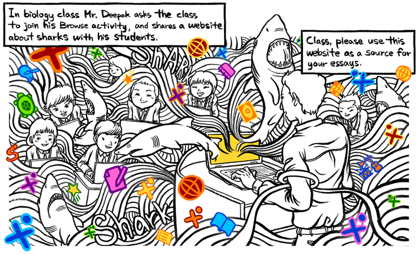

- Sugar supports sharing and collaboration. Using Sugar, teachers easily share things with their class: books and bookmarks; materials and activities.

{:.center-imgs}
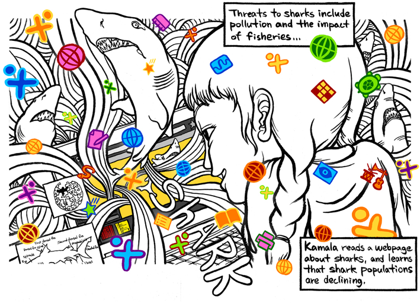

- Using Sugar, children collaboratively [browse](http://wiki.laptop.org/go/Browse) the web. They share links directly within the collaborative browsing sessions.

{:.center-imgs}
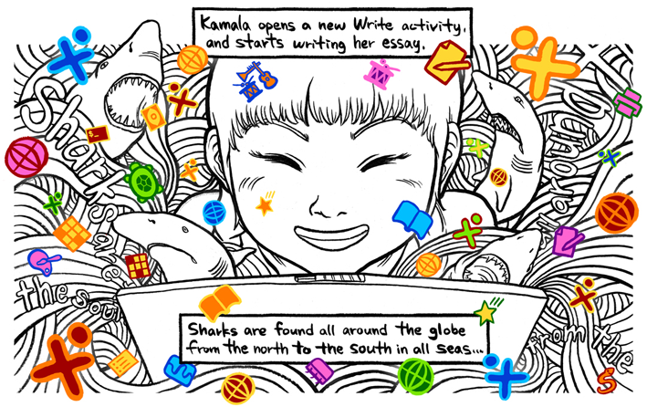

- Sugar comes with many core activities, including [Write](http://wiki.laptop.org/go/Write), a simple-to-use, collaborative word processor.

{:.center-imgs}
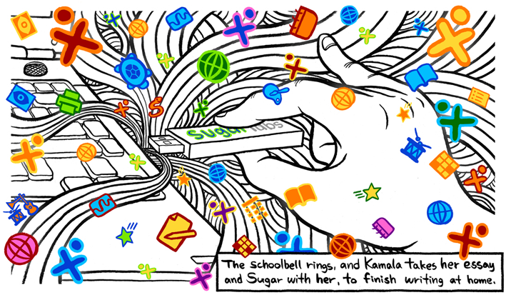

- [“Sugar on a Stick”](http://sugarlabs.org/go/Sugar_on_a_Stick) gives children access to their Sugar on any computer—they only need a USB key. At home or the library, they use the USB key on any computer to access their work.

{:.center-imgs}
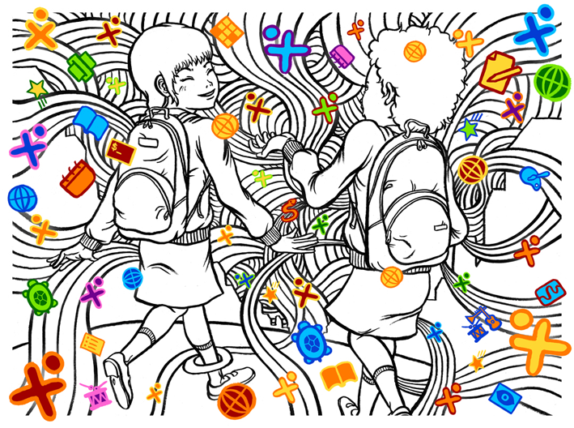

{:.center-imgs}
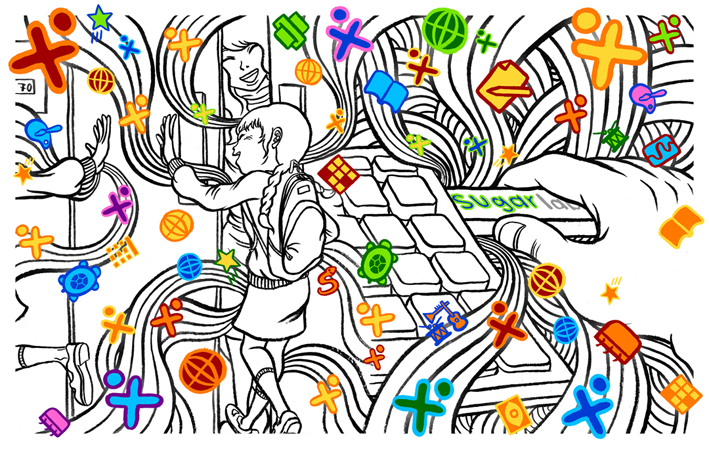

{:.center-imgs}
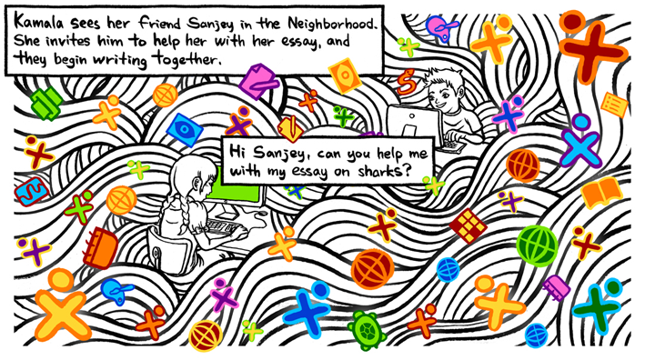

- In the Sugar Neighborhood view, children see their connected friends. Children are shown clustered around their current activities; they can join each other’s activities.

{:.center-imgs}
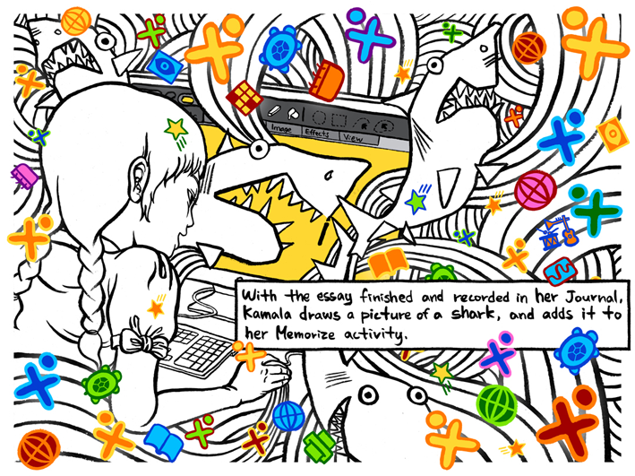

- The Sugar [Paint](http://wiki.laptop.org/go/Draw#Paint:_A_collaborative_space_for_creation) activity provides a canvas for children to express themselves creatively by drawing.

{:.center-imgs}
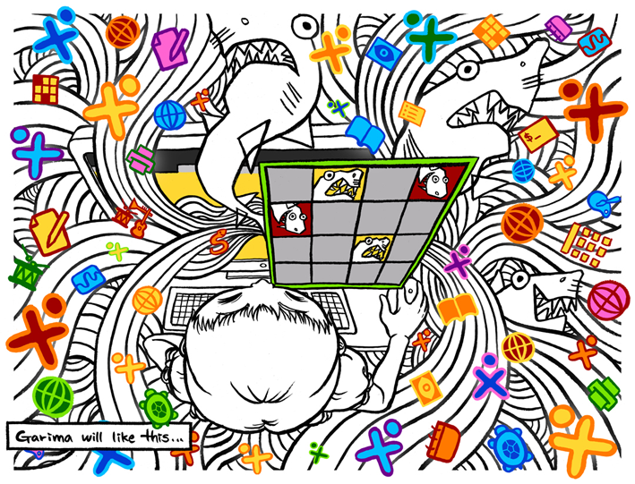

- The Sugar [Memorize](http://wiki.laptop.org/go/Memorize) activity is a game about finding matching pairs of words, images, sounds—even videos. Memorize allows you to create new games yourself.

{:.center-imgs}
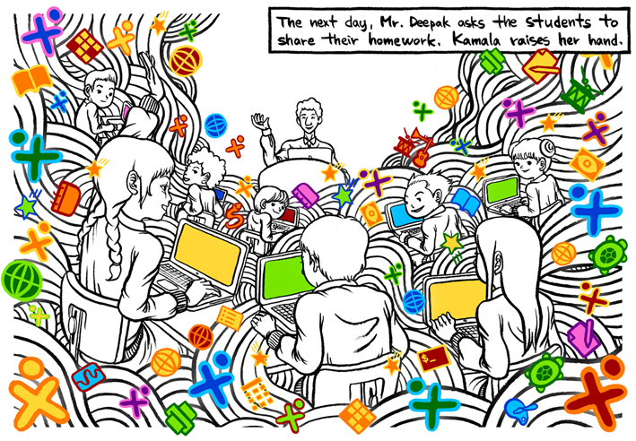

{:.center-imgs}
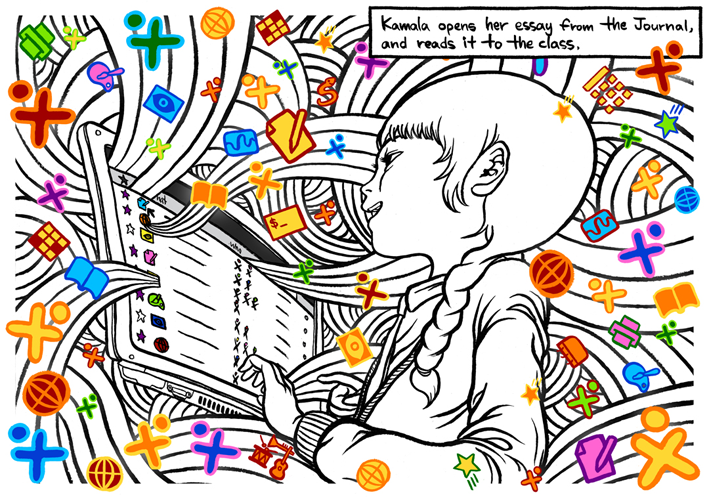

- The Sugar [Journal](http://wiki.laptop.org/go/Journal) records everything a child does using Sugar. There is no need to remember to save files. The Journal allows children to focus entirely on their activities.

{:.center-imgs}
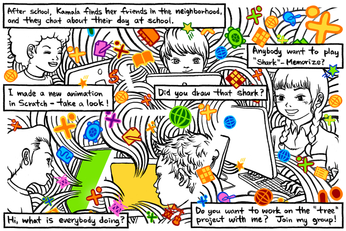

- Using Sugar, children can [chat](http://wiki.laptop.org/go/Chat) and exchange objects—pictures, games, writing—with their connected friends.

{:.center-imgs}
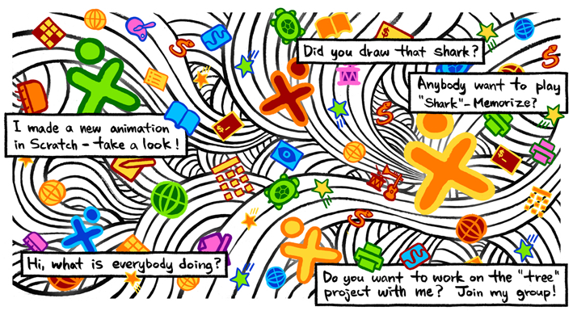

- Sugar provides a simple yet powerful means of engaging young children in the world of learning that is opened up by computers and the Internet. Sugar promotes sharing, collaborative learning, and reflection. Children develop skills that help them in all aspects of life.

[Learn more](http://sugarlabs.org/go/DocumentationTeam/Try_Sugar) about how you can try Sugar.

Illustrated by Dongyun Lee / [http://www.dongyunlee.com](http://www.dongyunlee.com)
